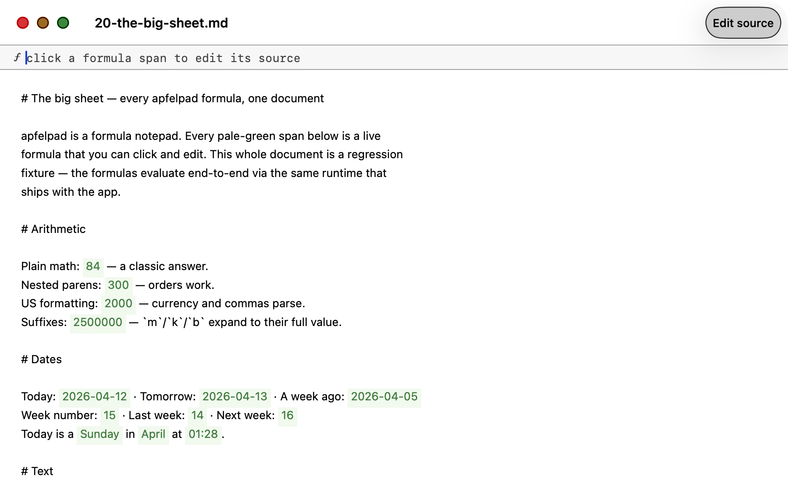

# apfelpad

> **v0.5.x.** apfelpad is in active development. Stable enough for daily use. [File an issue](https://github.com/Arthur-Ficial/apfelpad/issues) if something breaks.

**A formula notepad for thinking. On-device AI as a first-class function — Turing-complete by composition.**



Type `=apfel("a love letter", 42)` anywhere in a markdown document. Press Return. Foundation Models runs on your Mac, the tokens stream into a pale-green span, and the result is cached deterministically. Nest it: `=upper(=ref(@#intro))`. Branch on math: `=if(=math(5*5), "big", "small")`. Sum variadic args with US annotation: `=math($1,000,000 / 12)`.

Markdown underneath. 100% local. No API keys. Nothing leaves your Mac except an optional daily check to GitHub for new releases.

**Built on [apfel](https://github.com/Arthur-Ficial/apfel)** — the CLI + OpenAI-compatible HTTP server wrapping Apple's on-device `FoundationModels` framework. Architecture copied 1:1 from [apfel-chat](https://github.com/Arthur-Ficial/apfel-chat): SwiftUI + `@Observable` MVVM + protocol-driven TDD with swift-testing. Release pipeline identical. Signed, notarised, shipped via Homebrew cask.

> **Status: v0.5.0 shipped.** `brew install Arthur-Ficial/tap/apfelpad` · [Landing page](https://apfelpad.franzai.com) · [Latest release](https://github.com/Arthur-Ficial/apfelpad/releases/latest)

---

## What it does

apfelpad is a native macOS markdown notepad that embeds a formula evaluator. Every formula is a cell. Every cell renders inline. Every cell caches. Every cell is reproducible.

Think spreadsheets, but for text, with on-device AI as one of the functions.

### The formulas

**Every formula has a live example you can paste into the app.** The full reference with edge cases is **[docs/formulas.md](docs/formulas.md)**.

**On-device AI + math**

| Formula | Live example | Rendered result |
|---|---|---|
| `=apfel(prompt, seed?)` | `=apfel("write a haiku", 42)` | *(streaming)* |
| `=(prompt, seed?)` | `=(love letter, 42)` | *(anonymous shortcut)* |
| `=math(expression)` | `=math($1,250 + $750)` | `2000` |
| `=math` with US annotation | `=math(2m + 500k)` | `2500000` |

**Dates and time** (v0.3.0)

| Formula | Live example | Rendered result |
|---|---|---|
| `=date(offset?)` | `=date(+4)` | `2026-04-16` |
| `=cw(offset?)` | `=cw(-1)` | `14` |
| `=month() / =day() / =time()` | `=day() in =month()` | `Sunday in April` |

**Text** (v0.2.2 — Google-Sheets-style, pure Swift)

| Formula | Live example | Rendered result |
|---|---|---|
| `=upper(text)` | `=upper("hello")` | `HELLO` |
| `=lower(text)` | `=lower("WORLD")` | `world` |
| `=trim(text)` | `=trim("  hi  ")` | `hi` |
| `=len(text)` | `=len("apfelpad")` | `8` |
| `=concat(a, b, …)` | `=concat("Hello, ", "world")` | `Hello, world` |
| `=replace(t, f, r)` | `=replace("hi world", "world", "apfelpad")` | `hi apfelpad` |
| `=split(t, d, i?)` | `=split("a,b,c", ",", 1)` | `b` |
| `=if(cond, then, else)` | `=if("yes", "go", "stop")` | `go` |
| `=sum(n1, n2, …)` | `=sum(1, 2, 3)` | `6` |
| `=avg(n1, n2, …)` | `=avg(2, 4, 6)` | `4` |

**Document references** (v0.2.3+)

| Formula | Live example | What it does |
|---|---|---|
| `=ref(@#anchor)` | `=ref(@#intro)` | Insert the text of a named heading section, live |
| `=count(@#anchor?)` | `=count(@#intro)` | Word count of doc or a named section |
| `=clip()` | `=clip()` | Current clipboard contents (text only) |
| `=file(path)` | `=file("~/notes.txt")` | Read a local text file (max 1 MB) |

**Syntax note:** `@name` = input variable, `@#name` = section reference. This prevents collisions.

**Composition — Turing-complete** (v0.3.0)

Every formula can take another formula as an argument. The resolver walks the source bottom-up, substitutes each sub-call's evaluated result, then runs the outer call. Combined with `=if` (branching) and `=ref` (state), this is enough to express any computable function.

```
=upper(=ref(@#intro))                       → shouted section text
=upper(=trim(=lower("   HELLO   ")))        → HELLO (three levels)
=concat(=upper("a"), "-", =lower("B"))     → A-b (siblings)
=if(=math(5*5), "big", "small")            → big (25 is truthy)
=sum(=len("abc"), =len("de"), =math(10))   → 15
=apfel(=concat("summarize: ", =ref(@#intro)))  → AI reads the section
```

**Reactive variables** (v0.3.4)

| Formula | Live example | What it does |
|---|---|---|
| `=input(name, type, default?)` | `=input("hours", number, "40")` | Declare a reactive variable |
| `=show(@name)` | `=show(@hours)` | Echo the current value of a bound variable |

Typing a value into any `=input` re-evaluates every formula that references `@name` in real time. Combined with `=math`, `=if`, `=concat`, and `=apfel`, this turns any markdown document into an interactive calculator / form / AI-augmented proposal.

**v0.4 preview**

| Formula | Status |
|---|---|
| `=recording()` | Stub — parses, placeholder UI, real recording/transcription comes in v0.4 |

### Auto-quoting

You never have to remember quote syntax. If you type `=apfel(hello world)`, apfelpad canonicalizes it to `=apfel("hello world")` for you. Type English. apfelpad handles the parser.

### Inline rendering

Every evaluated formula renders as a light-green span in place, with a dark-green left border. The source is always one click away (formula bar at the top of the window, like Excel). Click to select, double-click to edit inline, ⌘Enter to run.

### Seeds and determinism

`=apfel("love letter", 42)` is reproducible. Same seed + same context + same model version → same output, via a composite cache key. Change the seed, regenerate. Change the prompt, regenerate. Never destructively.

### The formula sidebar

Type `=apfel(` and a sidebar slides in from the right with live argument help, context preview, token budget, seed picker, and recent-formulas history. Power users can close it and never see it again. Newcomers have a guided UX the first time they use the product.

---

## Requirements

| Requirement | How to check |
|---|---|
| **macOS 26 (Tahoe) or later** | Apple menu → About This Mac |
| **Apple Silicon (M1 or later)** | Apple menu → About This Mac — must say M1, M2, M3, or M4 |
| **Apple Intelligence enabled** | System Settings → Apple Intelligence & Siri |
| **apfel installed** | `brew install Arthur-Ficial/tap/apfel` (bundled in packaged builds) |

---

## Install

**Not yet available.** apfelpad is pre-implementation. When v0.1 ships, install will be:

```bash
brew install Arthur-Ficial/tap/apfelpad
```

Packaged builds (Homebrew, zip, one-liner installer) will bundle `apfel` so nothing extra is needed.

---

## Quick start (once built)

1. Open **apfelpad** from `/Applications`
2. Create a new document: `⌘N`
3. Type a heading: `# My first apfelpad doc`
4. Type `=apfel(hello world)` and press Return
5. Watch the formula span fill with light green as tokens stream in from your on-device model

---

## Why formulas?

Because every other "AI in documents" product dissolves the boundary between what you wrote and what the model wrote. Notion AI, Google Docs AI, Microsoft Copilot, Apple Writing Tools - they all silently inject text. You cannot rerun. You cannot see the prompt later. You cannot change the input without wiping the output. The model is a vandal with editor permissions.

Formulas fix this:

- **The prompt is visible.** The source shows `=apfel("love letter", 42)`. You never forget what you asked for.
- **The output is visibly generated.** Light-green background. Not your voice. Not your words.
- **You can rerun.** Change the seed. Change the prompt. Never destructively.
- **You can compose.** Nest formulas. Reference other blocks. Make the document self-referential.
- **You can share.** The formula source travels with the markdown file.

The AI becomes a first-class computable function, not a ghost with a cursor.

---

## Architecture

apfelpad is a SwiftUI app with a protocol-driven MVVM core and a pure Swift formula runtime. Full details in [BRIEFING.md](BRIEFING.md) and [CLAUDE.md](CLAUDE.md).

```
App → ServerManager (spawns apfel --serve on 11450)
    ↓
ViewModels (@Observable)
    ↓
FormulaRuntime → per-formula evaluators
    ↓ (for =apfel only)
ApfelHTTPService → apfel --serve → Foundation Models on your Mac
```

- Protocol + mock for every service
- SQLite for the formula cache
- swift-testing for the test suite
- Pragmatic about dependencies - well-maintained Swift packages are welcome for things like markdown parsing, math expression evaluation, and attributed-text editing (apfelpad diverges from the rest of the apfel family on this one point)
- Light-green visual language inherited from apfel-clip

---

## Related projects

- **[apfel](https://github.com/Arthur-Ficial/apfel)** - the on-device LLM CLI + OpenAI-compatible HTTP server. The engine apfelpad runs on.
- **[apfel-chat](https://github.com/Arthur-Ficial/apfel-chat)** - a native macOS chat client for Foundation Models. apfelpad's architectural template.
- **[apfel-clip](https://github.com/Arthur-Ficial/apfel-clip)** - menu bar clipboard actions (fix grammar, explain code, translate). apfelpad's visual language comes from here.
- **[apfel-gui](https://github.com/Arthur-Ficial/apfel-gui)** - the apfel debug GUI.
- **[apfel-quick](https://github.com/Arthur-Ficial/apfel-quick)** - quick-prompt menu bar utility.
- **[apfel-ecosystem](https://github.com/Arthur-Ficial/apfel-ecosystem)** - meta-repo documenting shared principles.

---

## Development

Pre-implementation. Once scaffolded:

```bash
swift build                # debug build
swift test                 # run tests
make app                   # build app bundle
make install               # build + copy to /Applications
make dist                  # build release zip + checksums
```

Tests cover the formula parser (auto-quoting is the single most important behaviour), the formula runtime, per-formula evaluators, context resolution, cache key hashing, and ViewModels. All via protocol+mock TDD - no UI tests, views are thin.

---

## Roadmap

- **v0.1** - Markdown editor + `=math` only. Proves the pipeline end-to-end without touching an LLM.
- **v0.2** - `=apfel(...)` inline, auto-quoting, seeds, streaming into the span.
- **v0.3** - Formula sidebar (the signature UX moment).
- **v0.4** - Named anchors + `=ref` + `=count`.
- **v0.5** - `=date`, `=clip`, `=file`.
- **v0.6** - Context strategy integration for long sections.
- **v0.7** - Cache management UI.
- **v0.8** - File format schema freeze.
- **v0.9** - Signing, notarisation, Homebrew cask.
- **v1.0** - Launch.

Each version is shippable. Full rationale in [BRIEFING.md](BRIEFING.md).

---

## Privacy

apfelpad makes **one** network call and it is not for inference: an optional daily check against `api.github.com` for new apfelpad releases (togglable in settings, on by default). Every language-model call goes to `localhost:11450` where `apfel --serve` runs on your machine, reading from the on-device `FoundationModels` framework. Documents are plain markdown files on your disk. The formula cache is a SQLite file in `~/Library/Application Support/apfelpad/cache/`. No telemetry. No accounts. No cloud inference. Ever.

Opt-in formulas like `=http(url)` (future, not v1.0) would require explicit per-formula consent and a loud warning. The default product runs offline.

## Updates

apfelpad checks for new releases on launch using the GitHub releases API (same pattern as [apfel-chat](https://github.com/Arthur-Ficial/apfel-chat)). If a newer version is available, a non-blocking banner offers to upgrade via `brew upgrade apfelpad` or a direct download. You can disable the check entirely in settings.

---

## License

MIT (planned). See [LICENSE](LICENSE) once the repo is scaffolded.

---

## Status

**Pre-implementation design.** Only the briefing exists right now. If you are reading this because Franz or Arthur told you to, start with [BRIEFING.md](BRIEFING.md) for the full design rationale. If you are a Claude session assigned to build v0.1, read [CLAUDE.md](CLAUDE.md) for the operational playbook.
